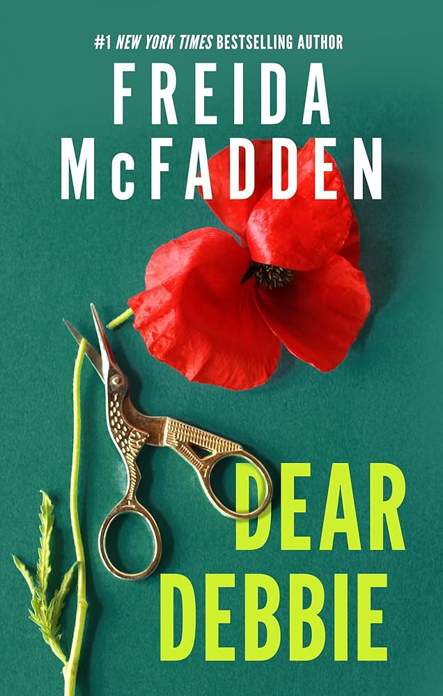

# Welcome 🌸
Bienvenue dans mon bookclub! Fan de romance,fantasy et de thriller je vous partage mes lectures du mois, mes avis et mes recommandations.

## Septembre 🌤️

En ce moment, je lis « Dear Debbie » de Freida McFadden.

Résumé : 

Mère et épouse dévouée, Debbie Mullen est à bout. Depuis des années, elle dispense ses conseils avisés dans la rubrique « Chère Debbie » du journal local. Elle a ainsi aidé des centaines de femmes maltraitées ou humiliées par leurs maris. 

Jusqu’au jour où sa propre vie vole en éclats : elle perd son emploi, ses filles adolescentes se comportent bizarrement, ses voisins deviennent insupportables... Pire, elle soupçonne que son mari lui cache de vilaines choses.

Désormais, Debbie refuse de continuer à jouer la gentille femme au foyer. Fini d’être raisonnable et pragmatique, il est temps pour elle de suivre ses propres conseils : l'heure de la vengeance a sonné. Une vengeance qui s'abattra sur tous ceux qui la méritent vraiment…  

Pour l'acheter : [Fnac](https://www.fnac.com/a22858837/Freida-McFadden-Chere-Debbie)

[ link to my introduction](introduction)

[Mes lectures du mois d'août ](secondpage.md)

