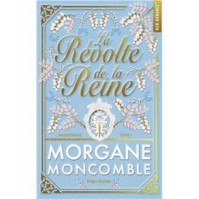

# Mes lectures du mois d'août 🏖️

«<em>La Révolte de la Reine</em>.» de Morgane Moncomble

Mon avis : ★★★★☆ (4/5)

### Résumé : 

>La Révolte de la Reine est le premier tome d'Inhéritance, la nouvelle trilogie de Morgane Moncomble. 

>1788, Versailles.

>Acacia se voit endosser un rôle qu’elle aurait tout donné pour éviter : reine de France. Pour le peuple, elle incarne l’espoir d’un pays à bout de souffle. Pour la cour, celui d’une souveraine vouée à sécuriser le trône. Or, la jeune mariée se révèle tout sauf docile : frivole, imprévisible et un brin rebelle, loin de l'exemplarité attendue d'elle. Elle fascine autant qu’elle scandalise.

>Son époux, Alexandre d’Arc du Lys, est détesté par tous ses sujets. Devenu roi par défaut après la mort de son frère aîné, il règne sous la menace constante de ses ennemis, et d’une maladie que beaucoup espèrent fatale. Acacia est pour lui une faiblesse de plus… et une dangereuse tentation.

>Depuis leur rencontre, leurs relations virent à l'affrontement. Pourtant, derrière les piques et les faux-semblants, une attraction brûlante menace de tout faire basculer.

>Alors que la famine gronde en France et que la Révolution approche, la reine devient une cible idéale. Acacia devra choisir : se plier au rôle qu’on lui impose… ou continuer de défier les règles pour changer le cours de l’histoire, quitte à tout perdre - même l’homme qu’elle n’aurait jamais dû aimer.

Acheter le livre ici ->  [Fnac ](https://www.fnac.com/a22032797/Morgane-Moncomble-La-Revolte-de-la-reine#description)

«<em>L'invitée surprise</em>.» de Alison Espach 

Ma note : ★★☆☆☆ (2/5)

#### Résumé : 
---------------
>Le Cornwall Inn, Phoebe a rêvé de cet hôtel avec son mari. Pourtant, lorsqu’elle descend du taxi, elle est seule, sans bagages, dans la magnifique robe de soie vert émeraude qu’elle n’a jamais osé porter. Si elle a vécu sans éclat, elle mourra avec panache. Tout est prévu, de la promenade sur la plage au coucher du soleil au plateau de fruits de mer, en passant par la crème brûlée et la boîte de comprimés… Tout, sauf un détail : l’hôtel est entièrement réservé pour un mariage grandiose, une semaine de festivités. Et la mariée ne laissera personne gâcher son grand jour.

Acheter le livre ici ->  [Fnac ](https://www.fnac.com/a22721115/Alison-Espach-L-Invitee-surprise#description)

[Page d'accueil ](index.md)

[Thriller](thirdpage.md)

